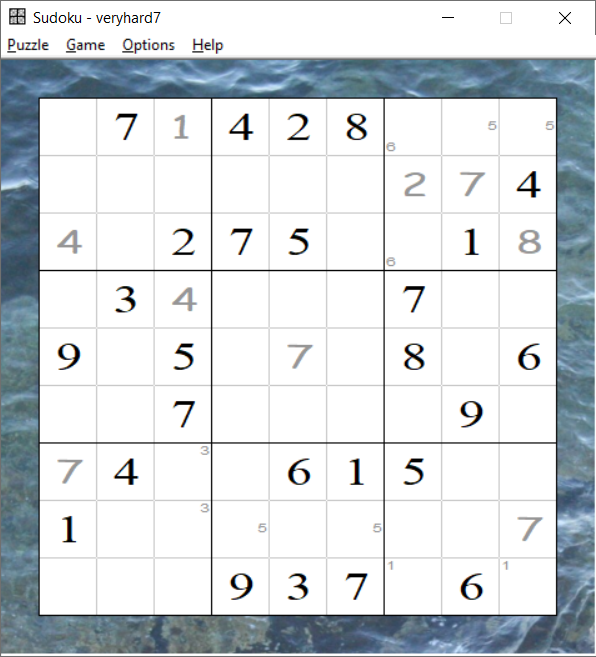

# Project-Images

A small portfolio of some projects that I've created. All projects were independently coded or built by me, except for the tensile tester, which I created with a team of six other students during college.

Sublight Settings - 6DOF joystick configuration program

<table>
  <tr>
    <td></td>
    <td></td>
  </tr>
</table>

Elaborinth - a 3D game engine designed around portal physics

<table>
  <tr>
    <td></td>
    <td></td>
  </tr>
</table>

Tensile tester - a school capstone project that I led, built to automatically mechanically test material strain curves up to 1100 lbs of force

<table>
  <tr>
    <td></td>
    <td></td>
  </tr>
</table>

Sudoku - a simple Sudoku game, with an automatic solver

Pofin - an autonomous robot that maps the locations of cylindrical obstacles (built as a college project)

